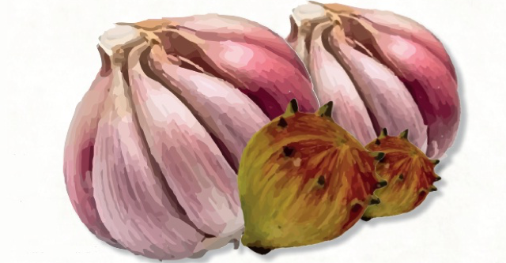

<h1 align="center">Alhos e bugalhos</h1>
<p align="center"></p>
<h3 align="center">É tudo a mesma coisa!</h3>


### Usage

```sh
uvicorn alhos_e_bugalhos:app --reload
```

### Contribute

When contributing it is a good idea to install the pre-commit hook. The hook
will run all checks when before you commit.

Please install [pre-commit](https://pre-commit.com/) (`python-pre-commit` on
Arch Linux) and then install the git hook:

```
pre-commit install
```
